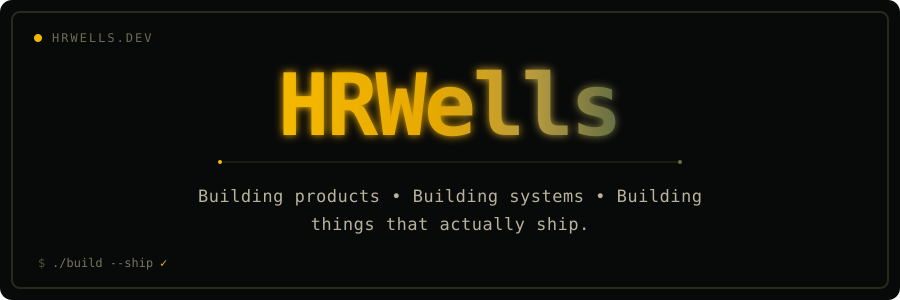

<div align="center">



<br>

# Hi, I'm Shubham 👋

### Full Stack Software Engineer

I build modern web applications, APIs, internal tools and digital products.

<br>

<a href="https://hrwells.dev/">
  
</a>

<a href="https://www.linkedin.com/in/shubham-kadam-0620b722a/">
  
</a>

<a href="mailto:kadamshubham10246@gmail.com">
  
</a>

<a href="https://t.me/h_r_wells">
  
</a>

</div>

---

## `whoami`

```bash
$ whoami

hrwells

$ cat about.txt

Full Stack Software Engineer
Next.js enthusiast
Node.js backend developer
TypeScript believer
Product builder
Occasional Linux terminal addict
````

I enjoy turning ideas into **production-ready software** — from frontend interfaces and APIs to deployment, servers and everything in between.

Currently focused on:

* ⚡ Next.js
* 🟦 TypeScript
* 🟢 Node.js
* ⚛️ React
* 📱 React Native
* 🗄️ PostgreSQL / MongoDB
* 🐳 Docker
* 🐧 Linux
* ☁️ Deployment & DevOps

---

## ⚡ What I Build

<table>
<tr>

<td width="50%">

### 🌐 Web Applications

Modern, responsive applications using:

- Next.js
- React
- TypeScript
- Tailwind CSS
- REST APIs
- Authentication
- Payments
- Webhooks

</td>

<td width="50%">

### ⚙️ Backend Systems

Backend systems using:

- Node.js
- Express
- Prisma
- PostgreSQL
- MongoDB
- REST APIs
- File uploads
- Authentication
- Background services

</td>

</tr>

<tr>

<td width="50%">

### 📱 Mobile Apps

Cross-platform mobile applications using:

- React Native
- Expo
- Android
- API integrations
- Authentication
- Push notifications

</td>

<td width="50%">

### 🚀 Deployment

I also work with:

- Linux
- Docker
- Nginx
- PM2
- VPS
- GitHub Actions
- CI/CD
- Vercel

</td>

</tr>
</table>

---

# 🧰 Tech Stack

### Frontend

<p>

</p>

### Backend

<p>

</p>

### Mobile

<p>


</p>

### DevOps & Tools

<p>

</p>

---

## 📊 GitHub Activity

<div align="center">





</div>

---

## 🐍 Contribution Graph

<div align="center">

<picture>

  <source
    media="(prefers-color-scheme: dark)"
    srcset="./profile/github-snake-dark.svg"
  />

  <source
    media="(prefers-color-scheme: light)"
    srcset="./profile/github-snake.svg"
  />

  

</picture>

</div>

---

# 💻 Developer Mode

```text
┌─────────────────────────────────────────────┐
│                                             │
│  $ git status                               │
│                                             │
│  On branch main                             │
│  Your branch is up to date with 'origin'.   │
│                                             │
│  Changes not staged for commit:             │
│                                             │
│      modified:   ideas.md                   │
│      modified:   projects.md                │
│      modified:   sleep.schedule             │
│                                             │
│  $ git add .                                │
│  $ git commit -m "another idea at 2AM"      │
│  $ git push                                 │
│                                             │
│  🚀 Everything shipped.                     │
│                                             │
└─────────────────────────────────────────────┘
```

---

# 🎯 Philosophy

> Build it.
> Break it.
> Understand it.
> Fix it.
> Ship it.

I prefer learning by **building real things**, solving actual problems and continuously improving the systems behind them.

---

<div align="center">

### Let's build something.

<br>

<a href="https://hrwells.dev/">

</a>

<a href="mailto:kadamshubham10246@gmail.com">

</a>

<br><br>


</div>
```